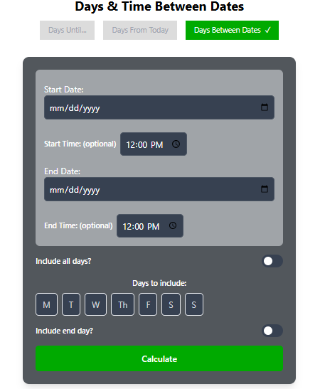
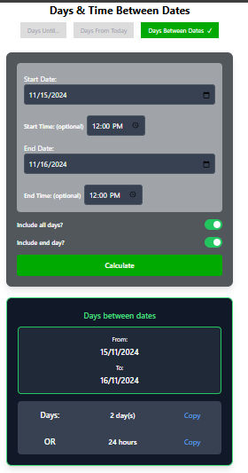

# Days and Time Between Dates Calculator

A responsive and intuitive web application that allows users to calculate the difference between two dates and times with added flexibility. Built using React, the app provides precise calculations and an easy-to-use interface for various scenarios.

## 🌐 Live Demo
View the Application : [Live Site](https://sibi1103.github.io/calculator/)

### 📌 Key Features
Date Selection Users can pick a start and end date for the calculation.

Optional Time Input
Allows users to include start and end times for precise calculations.

Toggle Options
### Include All Days:
 Switch to include all days between the selected dates.
### Include End Day:
 Switch to include the end date in the calculation.

Results Display
Shows the calculated difference in days and hours.
Includes a "Copy" button for quick sharing or usage of results.

## 🏗️ Components
Date and Time Input Section
### Start Date: 
Select the starting date.
### Start Time (optional): 
Set a specific starting time.
### End Date: 
Select the ending date.
### End Time (optional): 
Set a specific ending time.

### Toggle Options
Include All Days: Include all intermediate days in the calculation.
Include End Day: Include the last day in the calculation.
### Results Display
Displays:
Date Range: From and To dates.
Total Days or Hours: The calculated difference.
Includes a Copy option for results.

## 🛠️ User Guide
Select the start date and end date.
Optionally, set specific start and end times for precise calculations.
Toggle the Include All Days and Include End Day options as required.
Click Calculate to view the results.
Copy the results by clicking the "Copy" button next to each result.

## 🚀 Technology Stack
Front-end Framework: React
CSS Framework: (Specify if using Tailwind CSS, Bootstrap, etc.)

## 📸 Screenshots

# Getting Started with Create React App

This project was bootstrapped with [Create React App](https://github.com/facebook/create-react-app).

Steps to Run Locally
Clone the repository:
git clone

Navigate to the project directory:
cd my-app

Install dependencies:
In the project directory, you can run:
### `npm install`

### `npm start`

Runs the app in the development mode.\
Open [http://localhost:3000](http://localhost:3000) to view it in the browser.

The page will reload if you make edits.\
You will also see any lint errors in the console.

